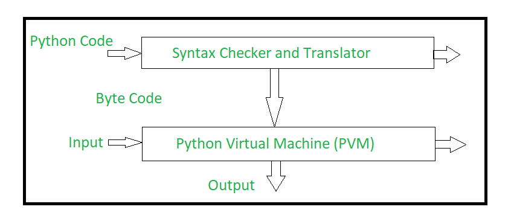
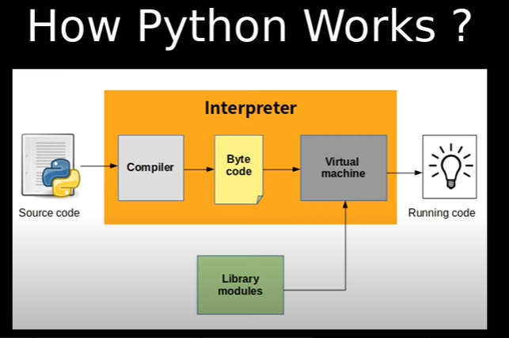
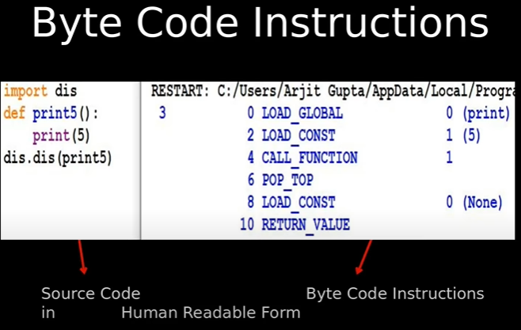

## How Python Works?
* Python is an object-oriented programming language like Java. 
* Python is called an interpreted language. 
* Python is dynamically typed language because the types of variables are determined during runtime
* Python uses code modules that are interchangeable instead of a single long list of instructions that was standard for functional programming languages. 
* The standard implementation of python is called **cpython**. 
  It is the default and widely used implementation of Python. 
* Python doesn’t convert its code into machine code, something that hardware can understand. It actually converts it into something called **byte code**. So within python, **compilation happens**, but it’s just not into a machine language. It is into byte code (.pyc or .pyo) and this byte code can’t be understood by the CPU. So we need an interpreter called the **python virtual machine** to execute the byte codes. 
* By default, your Python programs have a single thread, called the main thread. You can create threads by passing a function to the Thread() constructor or by inheriting the Thread class and overriding the run() method.
* Python is cross-platform. You can execute almost any Python program on Windows, Mac, Linux hardware, and even Android and iOS
* **Byte-code** are binary(0,1) but the processor can't understand it.But PVM can.

#### Python working
* 
* 

#### Disassembler
* Disassembler converts by-code into human understandable form.
* 

### The Python source code goes through the following to generate an executable code :
* **Step 1:** The python compiler reads a python source code or instruction. Then it verifies that the instruction is well-formatted, i.e. it checks the syntax of each line. If it encounters an error, it immediately halts the translation and shows an error message.
* **Step 2:** If there is no error, i.e. if the python instruction or source code is well-formatted then the compiler translates it into its equivalent form in an intermediate language called **Byte code**.
* **Step 3:** Byte code is then sent to the **Python Virtual Machine(PVM)** which is the python interpreter. PVM converts the python byte code into **machine-executable code**. If an error occurs during this interpretation then the conversion is halted with an error message.

### Resources
* [How Python Works | Python programming Language working ](https://www.youtube.com/watch?v=-ZPg5lJCln8)
* [What is the Python Interpreter? (How does Python Work? - very important video)](https://www.youtube.com/watch?v=BkHdmAhapws)
* [Internal working of python - geeks for geeks](https://www.geeksforgeeks.org/internal-working-of-python/)
* [How python works - the conceptual](https://www.youtube.com/watch?v=CmjEGiWvkCk)