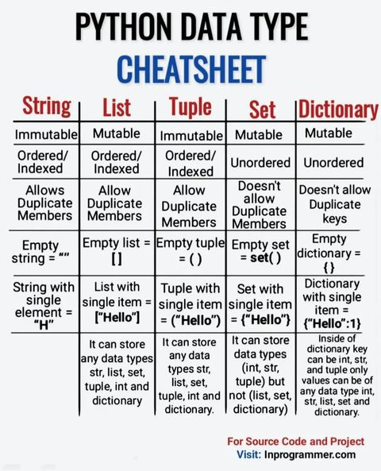
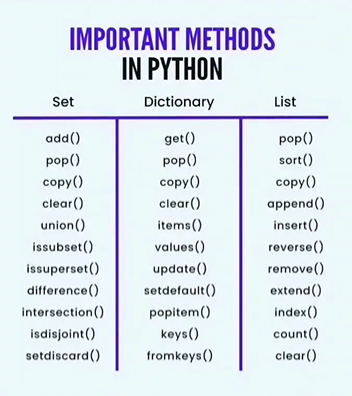

### 100_Days_Of_Python.

#### Resources

##### Youtube

- <a href="https://www.youtube.com/watch?v=gfDE2a7MKjA&t=312s">
  Python Tutorial For Beginners In Hindi (With Notes) By Code with harry
  </a>

- <a href="https://docs.python.org/3.10/tutorial/index.html">Python Version 3.10.6 Documentation</a>

* 
Data types in Python

* 

* 
Important methods in Python

* 

#### Books
* <a href="https://github.com/AlFahimBinFaruk/100_Days_Of_Python/blob/main/assets/Books/Functional%20Programming%20in%20JavaScript_%20How%20to%20improve%20your%20JavaScript%20programs%20using%20functional%20techniques%20(%20PDFDrive%20).pdf">Functional programming in Js - Read this to know how functional programming works in Functional language
</a>

* <a href="https://github.com/AlFahimBinFaruk/100_Days_Of_Python/blob/main/assets/Books/Functional%20Programming%20in%20Java_%20How%20functional%20techniques%20improve%20your%20Java%20programs%20(%20PDFDrive%20).pdf">Functional programming in Java - Read this to know how functional programming works in OOP language
</a>

* <a href="https://github.com/AlFahimBinFaruk/100_Days_Of_Python/blob/main/assets/Books/oop%20in%20java%20c.thomas%20wu%20-%20read%20this%20book%20to%20know%20about%20OOP%20in%20Depth.pdf">OOP in Java - for how to write OOP code in OOP language
</a>